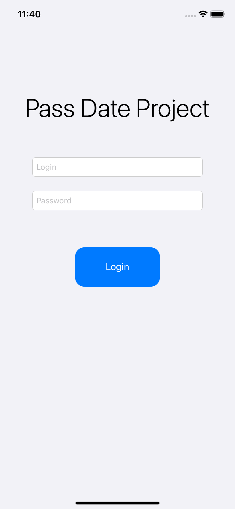
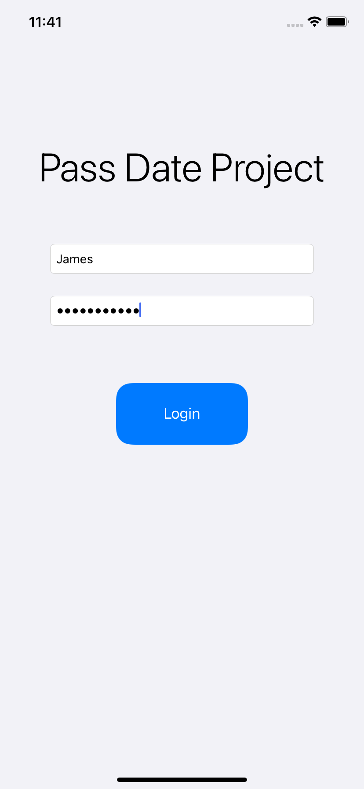
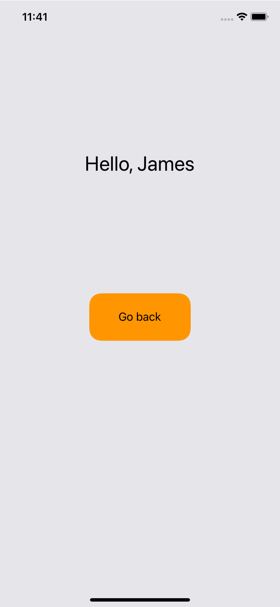
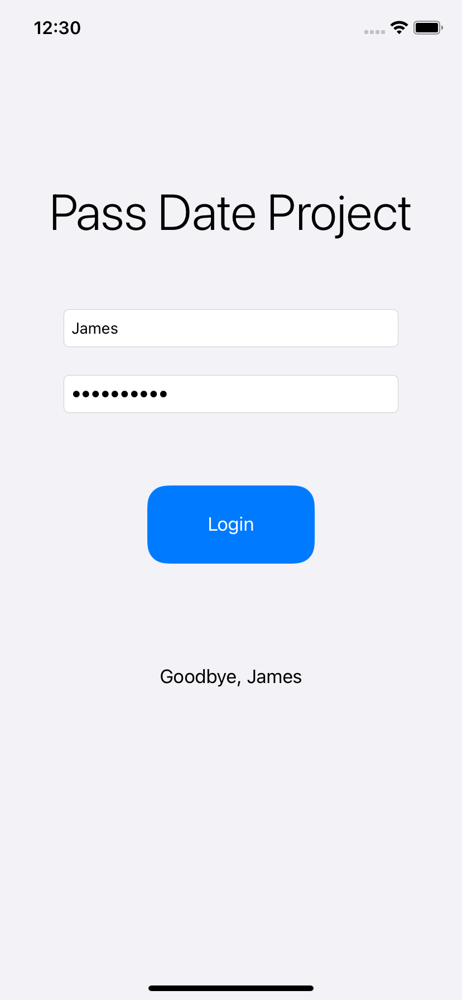

# Study Project: Pass Date Project
A learning project as part of a Swift Book course. An application simulating an account login form.

# 1. Main screen
The main screen displays a label with the name, two fields to fill in with hints and a button to enter from the bottom, there is also a label at the bottom that will display data when exiting.

# 2. Data entery
The login is entered in the upper field, and the password in a hidden format is entered in the lower field.

# 3. Login screen
There are two elements on the login screen: a label and a button. The label contains a greeting and a user login. The button returns the user to the main screen.

# 4. Return to the home screen
When returning to the main screen, the bottom (invisible) label displays the farewell and login of the exited user.

